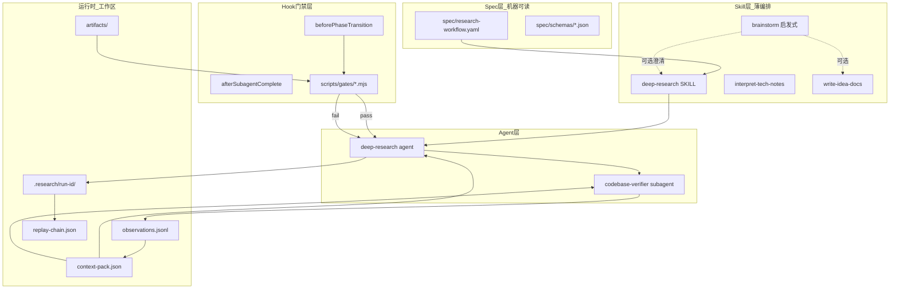

# dev-env — Cursor Agent 工作流

[](https://github.com/JunfengRan/dev-env/actions/workflows/validate-research.yml)
[](https://github.com/JunfengRan/dev-env/actions/workflows/validate-mermaid.yml)
[](LICENSE)

可独立开源的 Cursor 配置包：**Spec 状态机 + ContextPack + Gate 门禁 + Skills/Agents/Rules/Plugins**。

与「纯 skills 合集」不同：本仓把深度研究做成**可校验、可回放**的运行时——YAML Spec 定义阶段，确定性 gate 脚本放行，ContextPack / replay-chain 留下证据链。

## 核心 vs 附带

| 类别 | 内容 |
|------|------|
| **核心** | `spec/`、`scripts/`（reducer / gates / research-cli）、`agents/deep-research*`、`skills/deep-research`、`rules/deep-research.mdc`、`plugins/deep-research-gates` |
| **启发式补充** | `skills/brainstorm` — 创意澄清与方案取舍（**非** Spec 硬阶段） |
| **附带（可选）** | Vue / Electron / Pinia 等最佳实践 skills、`plugins/continual-learning-rules`、项目 overlay 示例 |

## 组件

| 目录 | 说明 |
|------|------|
| [`spec/`](spec/) | `research-workflow.yaml` 状态机 Spec + JSON Schema |
| [`scripts/`](scripts/) | Mermaid/research 校验、reducer、gate、**research-cli** |
| [`agents/`](agents/) | deep-research、codebase-verifier、code-simplifier |
| [`rules/`](rules/) | 通用工作流规则（deep-research / dev-workflow / git-commit） |
| [`skills/`](skills/) | deep-research、brainstorm（启发式）、interpret-tech-notes、write-idea-docs 等 |
| [`plugins/`](plugins/) | continual-learning-rules、deep-research-gates |
| [`docs/`](docs/) | 示例、产出目录、可选项目 overlay |

## 快速安装与插件分发

按需复制到目标项目或用户目录。建议顺序：最小集 → 门禁插件 → 可选组件。

运行时要求：Node.js 22–26、npm 10+。插件 hook 额外需要 Bun 1.3+。

### 1. 最小集（项目级）

```bash
# 项目根目录
cp -r rules/ .cursor/rules/
cp -r agents/ .cursor/agents/
mkdir -p .cursor/skills
cp -r skills/deep-research .cursor/skills/
# 可选：意图澄清（非 Spec 阶段）
cp -r skills/brainstorm .cursor/skills/
# 若要用 consolidate / decide 阶段，一并复制：
cp -r skills/interpret-tech-notes .cursor/skills/
cp -r skills/write-idea-docs .cursor/skills/
```

同时保留本仓的 `spec/` 与 `scripts/`（或把整个仓库作为 git submodule / 拷贝进项目），以便 gate 与 `research-cli` 可执行。

### 2. 门禁插件（用户级，需 [Bun](https://bun.sh)）

hooks 通过 `bun run` 执行：

```bash
cp -r plugins/deep-research-gates ~/.cursor/plugins/
```

仓库根目录包含 `.cursor-plugin/marketplace.json`，也可把本仓作为多插件
marketplace 添加到 Cursor，再安装 `deep-research-gates` 或
`continual-learning-rules`。

插件在 `stop` 时调用工作区 `node scripts/research-cli.mjs advance`：gate 失败会写回 ContextPack `gateLastResult`，并跟进修复消息。

### 3. 可选组件

```bash
# 偏好学习 → 写入 .cursor/rules/*.mdc
cp -r plugins/continual-learning-rules ~/.cursor/plugins/

# Vue / Electron 等知识库 skills（非研究工作流必需）
cp -r skills/vue-best-practices .cursor/skills/
# …按需复制其他 skills/

# 项目专有 rules：为任意目标仓库（如 OpenCode 或你的应用）自行维护 .cursor/rules/
# 说明见 docs/examples/overlays/README.md
```

### 验证安装

在本仓库（或已复制 `scripts/` + `spec/` 的项目）中：

```bash
npm ci
npm run validate
```

## Research CLI

编排入口把纯 reducer 接到磁盘（`state.json` / ContextPack / replay-chain）：

```bash
# 初始化 run
npm run research -- init 2026-07-24-my-topic-abc12 --slug my-topic

# 查看状态（或设 RESEARCH_RUN_ID / --run-id）
npm run research -- status
npm run research -- status .research/2026-07-24-my-topic-abc12

# 写完当前 phase artifacts 后跑 gate 并推进
npm run research -- advance
npm run research -- advance .research/2026-07-24-my-topic-abc12

# 校验 run Schema、阶段记录、快照和 artifact 哈希
npm run research -- verify .research/2026-07-24-my-topic-abc12

# 手动应用 reducer 事件（如 SUBAGENT_COMPLETED）
npm run research -- apply .research/<run-id> '{"type":"SUBAGENT_COMPLETED","subagentId":"runtime-core"}'
```

活动 run 解析：优先 `--run-id` / `RESEARCH_RUN_ID`，否则取 `.research/*/state.json` 中 mtime 最新且非 `done`/`aborted` 的目录。

## Deep Research 工作流

真相源：[`spec/research-workflow.yaml`](spec/research-workflow.yaml)。主路径：`brief → explore → verify → consolidate → compare → crystallize → decide → done`；gate 失败停留当前态，任意阶段可 `USER_ABORT → aborted`。



1. 读 `spec/research-workflow.yaml`
2. `npm run research -- init <run-id>` 初始化 `.research/<run-id>/`
3. 按 state 执行 agent/skill/subagent
4. `npm run research -- advance`：gate 验证后推进状态并 bump ContextPack
5. ContextPack 版本化 + replay-chain 记录

可选：意图未对齐时用 [`skills/brainstorm`](skills/brainstorm/SKILL.md) 做启发式澄清（**不**进入 Spec 状态机）。

详见 [`skills/deep-research/SKILL.md`](skills/deep-research/SKILL.md) 与 [`docs/examples/sample-research-run/`](docs/examples/sample-research-run/)。

## CI

```bash
npm ci
npm run validate          # mermaid lint + research-spec + gates + reducer + research-cli
npm run validate:mermaid
npm run validate:research-spec
npm run test:gates
npm run test:reducer
npm run test:persistence
npm run test:integrity
npm run test:plugins
npm run test:research-cli
npm run validate:plugins
```

默认 Mermaid 校验为 **lint-only**（可跳过 Chromium 下载）。若本机已有 Chrome，可额外渲染：

```bash
npm run validate:mermaid -- --render
```

`replay-chain.json` 提供带 SHA-256 和运行时版本的**可审计阶段续跑**，
用于检测快照或产物漂移；它不缓存完整模型/工具调用，因此不宣称离线确定性重放。

## License

MIT — 见 [LICENSE](LICENSE)
