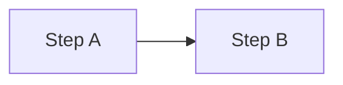

# 绘制 GitHub 兼容的 Mermaid 图

在 `dev-env` 仓库的 Markdown 中编写 Mermaid 时，遵循本 skill，并在提交前运行验证。

## 工作流

1. **确定图类型**：flowchart / sequenceDiagram / stateDiagram-v2 / erDiagram / gantt
2. **按兼容性规则编写**（见下文）
3. **本地验证**：`npm run validate:mermaid`
4. **提交**：CI 工作流 `.github/workflows/validate-mermaid.yml` 会自动复检

## GitHub 兼容性规则（必须遵守）

### 通用

| 规则 | 说明 |
|------|------|
| 节点 ID | 用 camelCase，无空格：`userService`，不用 `user_service` |
| 保留字 | 不用 `end`、`subgraph`、`graph`、`loop` 作节点/参与者 ID |
| 特殊字符 | `@ / ( ) #` 等必须包在引号内：`A["@scope/pkg"]` |
| 多词标签 | 一律加引号：`B["AI SDK streamText"]` |
| 不用 emoji | GitHub 渲染器可能拒绝 |
| 不用 `\n` | 用实际换行或缩短标签，勿写 `\n` 转义 |

### flowchart

- 边标签含特殊字符时加引号
- subgraph 标题加引号
- 避免 `@pkg/name` 裸写在 `[]` 内

### sequenceDiagram

- 参与者 ID 不能与 `loop`/`alt` 等关键字冲突
- 多词显示名必须引号

## 验证命令

```bash
npm install
npm run validate:mermaid
npm run validate:mermaid -- --render
```

## 输出格式

````markdown

````
