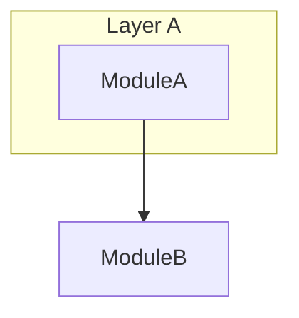

# 架构文档模板（*-architecture.md）

```markdown
# {主题} — 架构设计

> **文档类型**：开源设计想法 · 非绑定任何内部产品 · [可选说明]
> **技术栈**：[{topic}-tech-stack.md](./{topic}-tech-stack.md)
> **版本**：vX.Y · YYYY-MM

---

## 1. 核心 Idea

1. **要点一**：…
2. **要点二**：…
3. **要点三**：…

---

## 2. 术语

| 表述 | 含义 |
|------|------|
| … | … |

---

## 3. 探索过程与方案取舍

### 3.1 现状 / 背景

…

### 3.2 曾考虑的方案

| 维度 | 方案 A（不采纳） | 本设计（采纳） |
|------|------------------|----------------|
| … | … | … |

**结论**：…

### 3.3 设计约束

- …

---

## 4. 参考架构



### 4.1 模块职责

| 模块 | 职责 |
|------|------|
| … | … |

---

## 5. 关键流程

（可选 sequenceDiagram 或分步说明）

---

## 6. 演进路线

| Phase | 范围 | 验收 |
|-------|------|------|
| … | … | … |

---

## 7. 开放问题

- …
```

## 章节取舍

- 小型 Idea：可合并 §2 术语到 §1 脚注。
- 无多方案对比：§3.2 可简化为「设计约束」。
- 尚无实现：§6 写 Phase 0/1 即可。
